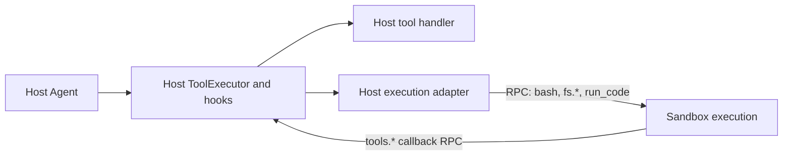

This guide shows how to package a Bub **plugin** — a Python distribution that registers under the `bub` entry-point group and contributes [hook](/docs/concepts/turn-pipeline/) implementations to the framework runtime.

To load portable Agent Plugins containing `plugin.json`, skills, and MCP servers, see
[Load Agent Plugins](/docs/tutorials/agent-plugins/). The `bub-agent-plugins` integration is itself a Python
plugin; the portable packages it loads do not need Python entry points.

## Before you begin

- A working Python 3.12+ environment with `uv` and `bub` installed (see [Install](/docs/getting-started/install/)).
- Familiarity with one full turn through Bub (see [First turn](/docs/getting-started/first-turn/)).
- A `pyproject.toml`-based build backend; the examples below use `hatchling`.

## 1. Package layout

A minimal plugin is one Python package plus a `pyproject.toml`:

```text
bub-myplugin/
├─ pyproject.toml
└─ src/
   └─ bub_myplugin/
      ├─ __init__.py
      ├─ plugin.py
      └─ tools.py        # optional, see step 4
```

Use a distribution name that begins with `bub-` (for example `bub-myplugin`). The import name typically replaces the dash with an underscore (`bub_myplugin`).

## 2. Declare the entry point

Bub discovers plugins through Python entry points in the `bub` group. Add the entry inside `pyproject.toml`:

```toml
[project]
name = "bub-myplugin"
version = "0.1.0"
dependencies = ["bub>=0.3"]

[project.entry-points."bub"]
myplugin = "bub_myplugin.plugin"

[tool.hatch.build.targets.wheel]
packages = ["src/bub_myplugin"]
```

The entry-point key on the left (`myplugin`) is the name Bub uses for diagnostics. The value on the right is what Bub imports at startup.

## 3. Choose between a module, instance, or callable

[`BubFramework.load_hooks()`](https://github.com/bubbuild/bub/blob/main/src/bub/framework.py#L66-L90) accepts three shapes for the entry-point target. The `if callable(plugin)` branch is the discriminator:

```python
# from src/bub/framework.py
if callable(plugin):  # Support entry points that are classes
    plugin = plugin(self)
self._plugin_manager.register(plugin, name=plugin_name)
```

That gives you three valid choices.

**Module target.** Point at a module that defines `@hookimpl`-decorated functions at module level. Bub registers the module object directly:

```toml
[project.entry-points."bub"]
myplugin = "bub_myplugin.plugin"
```

```python
# bub_myplugin/plugin.py
from bub import hookimpl


@hookimpl
def build_prompt(message, session_id, state):
    return "custom prompt"
```

**Instance target.** Point at a pre-built instance. Bub registers it as-is:

```toml
[project.entry-points."bub"]
myplugin = "bub_myplugin.plugin:my_plugin"
```

```python
# bub_myplugin/plugin.py
from bub import hookimpl


class MyPlugin:
    @hookimpl
    def build_prompt(self, message, session_id, state):
        return "custom prompt"


my_plugin = MyPlugin()
```

**Callable target (class or factory).** Point at a class or factory that takes the [`BubFramework`](https://github.com/bubbuild/bub/blob/main/src/bub/framework.py) as its only argument. Bub calls it with the framework and registers the result. Use this when the plugin needs a live reference to the framework — for example to read `framework.workspace` after the CLI has applied `--workspace`:

```toml
[project.entry-points."bub"]
myplugin = "bub_myplugin.plugin:MyPlugin"
```

```python
# bub_myplugin/plugin.py
from bub import BubFramework, hookimpl


class MyPlugin:
    def __init__(self, framework: BubFramework) -> None:
        self.framework = framework

    @hookimpl
    def build_prompt(self, message, session_id, state):
        workspace = self.framework.workspace
        return f"custom prompt from {workspace}"
```

Visual-base's [`EyeImpl`](https://github.com/oilbeater/visual-base/blob/main/src/bub_eye/plugin.py) uses the callable form for exactly this reason: it captures the framework so `provide_channels` can read the post-CLI workspace.

:::note
Builtin is registered first; entry-point plugins are registered after. Inside the [`HookRuntime`](https://github.com/bubbuild/bub/blob/main/src/bub/hooks/runtime.py), later registrations have higher precedence — so your plugin's `firstresult` hooks override the builtin.
:::

## 4. Iterate with an editable install

Install the plugin into the same Python environment that runs `bub`. If you have already activated that environment, run this from the plugin directory:

```bash
uv pip install -e .
```

Bub loads entry points from the active Python environment, so editable installs pick up code changes without reinstalling. If you are not working inside an already-active Bub virtualenv, run `uv sync` in the plugin project and use `uv run bub ...` from that project instead. The same pattern shown in [First plugin](/docs/getting-started/first-plugin/) applies here.

## 5. Confirm Bub loaded your plugin

Run the hook diagnostics command:

```bash
uv run bub hooks
```

Each registered hook lists the plugins that contribute to it. The command reports discovery order, not the exact firstresult winner; runtime priority is described in [Hook reference](/docs/reference/hooks/#iteration-order). Expected output for an `EchoPlugin` that overrides `build_prompt` and `run_model`:

```text
build_prompt: builtin, echo
run_model: builtin, echo
...
```

If your plugin name is missing from every line, the entry point did not load. Common causes:

- The entry-point group is misspelled — it must be `bub` (not `bub.plugins`).
- The package is not installed in the active Python environment.
- The import path raises at module import time. Bub logs the error as `Failed to load plugin '<name>'`.

## Real-world examples

The patterns above are visible in shipping plugins:

- [`bub-tapestore-sqlite`](https://github.com/bubbuild/bub-contrib/tree/main/packages/bub-tapestore-sqlite) — module target with a top-level `@hookimpl`.
- [`bub-schedule`](https://github.com/bubbuild/bub-contrib/tree/main/packages/bub-schedule) — instance target (`schedule = "bub_schedule.plugin:main"`).
- [`bub-wechat`](https://github.com/bubbuild/bub-contrib/tree/main/packages/bub-wechat) and visual-base's [`bub-eye`](https://github.com/oilbeater/visual-base/tree/main/src/bub_eye) — callable-class target that holds a framework reference.

## Execution environments

### When to use one

Use an execution environment plugin to run filesystem, shell or code operations outside the host while keeping Tape, model calls and tool dispatch on the host. An adapter can delegate all three to a container, isolate only `run_code` in a WASI runtime, or combine container-backed files and shell with WASI code execution. These are adapter designs, not bundled backends; a code-only adapter must explicitly compose with a filesystem and shell provider.

### Execution path

Tool handlers stay on the host. Sandbox-backed handlers delegate execution over a transport owned by the adapter. Code calling `tools.*` sends a request back to the host, where the tool executor applies the usual interception hooks.



RPC is an adapter responsibility, not a separate Bub hook. The diagram shows model tool calls and code callbacks; explicit comma commands use direct dispatch. Code callbacks receive only the tools exposed by code mode, not the entire host registry. `preserve` controls that exposure, not execution location.

### Adapter contract

Implement `provide_execution_environment(session_id, state)` to return an `ExecutionEnvironment` from `bub.environment`.

- **Acquire use:** Implement `acquire()` as an async context manager yielding an `ExecutionEnvironment` (possibly `self`). Bub enters it before binding tools and exits after turn and Tape cleanup, including stream closure and errors. Exit releases this use, not background jobs or the environment itself. Providers must clean up failed acquisition, coordinate reclamation and reject disabled handles. Local acquisition is a no-op.
- **Bind execution tools:** Bub calls `bind_tools(tools)` once at turn setup for `bash`, `bash.output`, `bash.kill`, `fs.read`, `fs.write`, `fs.edit` and `run_code`, when present. Return the same names and public contracts with adapted handlers, or raise if unsupported. Other tools keep their host handlers; the shared Agent is not modified.
- **Dispatch code callbacks:** Use `bub.builtin.codemode.code_tool_callbacks(context)` in the host-side `run_code` handler. It returns the current turn's named async callbacks, preserving context, structured results and tool hooks. Expose only these callbacks over RPC; the adapter owns serialization, concurrency and cancellation.
- **Map resources:** `map_resource(source)` returns an execution-side path for explicitly loaded skills and code-mode stubs. The provider owns copying or mounting and resource lifetime; mapping implies neither synchronization nor write-back. Skill rendering uses the mapped `$SKILL_DIR` and optional `render_context["PYTHON"]` (default: `python`).

### Switching and lifecycle

A turn keeps one binding. `,environment <reference>` selects the next turn's environment after provider authorization, including when switching to `default`. Managed background work blocks switching; unavailable named environments fail rather than falling back to the host. Tape records the selection, but files and processes are not migrated.

The provider owns retained instances, disposal and restart continuity. Register stable environment handles and defer physical allocation to `acquire()`. For hybrids, acquire dependencies with `AsyncExitStack` so partial acquisition rolls back. Framework caches retain handles: registering a new object under the same name does not replace cached objects; disable old handles explicitly and use a new reference when replacing an environment identity. `,quit` awaits `stop()`, which must cancel owned work without disposing of the retained environment. Consume or close Agent streams to release bindings; nested same-session execution is rejected. Resources prepared before a failed Tape update may remain retained.

Local execution is trusted host execution, not isolation. Automatic skill prompt expansion remains host-side; use explicit skill loading for resource mapping. The execution-tool set is fixed, not a routing registry for arbitrary plugin tools.

## Next steps

- [Hooks](/docs/build/hooks/) — recipe cookbook for each hook signature
- [Tools](/docs/build/tools/) — register tools the model can call
- [Hook reference](/docs/reference/hooks/) — full signature table
- [Distribution](/docs/build/distribution/) — bundle plugins into a product
