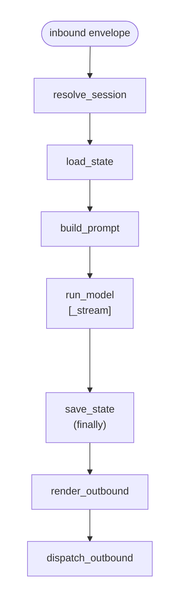

This section explains the model behind Bub: why the kernel is small, what one turn actually does, how context is reconstructed from a tape, and where the three extension surfaces meet.

## How to read this section

Read the four pages in order on your first pass. Each page is short and self-contained:

1. [Philosophy](/docs/concepts/philosophy/) — why the kernel is strict and plugins are loose, and why operators are equivalent.
2. [Turn pipeline](/docs/concepts/turn-pipeline/) — what `process_inbound` runs, in order, and where each fallback kicks in.
3. [Tape and context](/docs/concepts/tape-and-context/) — how an append-only tape becomes the model's context window.
4. [Surfaces](/docs/concepts/surfaces/) — channels, skills, and tools as three independent extension axes.

After your first pass, treat each page as a reference and return to specific sections as you build.

## One-glance turn flow

This is the same diagram you will see expanded in [Turn pipeline](/docs/concepts/turn-pipeline/):

`save_state` always runs in a `finally` block; `render_outbound` and `dispatch_outbound` run only when the turn succeeds.

## Glossary

Quick links to where each term is defined:

- [Hook](/docs/concepts/turn-pipeline/) — a [pluggy](https://pluggy.readthedocs.io/) extension point the kernel calls during a turn.
- [Plugin](/docs/concepts/philosophy/) — any package registered under the `bub` entry-point group.
- [Tape](/docs/concepts/tape-and-context/) — an append-only sequence of facts for one session.
- [Entry](/docs/concepts/tape-and-context/) — one immutable record on a tape.
- [Anchor](/docs/concepts/tape-and-context/) — a checkpoint the kernel can rebuild context from.
- [Handoff](/docs/concepts/tape-and-context/) — a constrained phase transition that writes a new anchor.
- [Channel](/docs/concepts/surfaces/) — an outward I/O surface (CLI, Telegram, ...).
- [Skill](/docs/concepts/surfaces/) — a reusable procedure operators (human or agent) can invoke by name.
- [Tool](/docs/concepts/surfaces/) — a typed action the model can call.
- [Envelope](/docs/concepts/surfaces/) — the duck-typed payload passed through the turn pipeline.

## Next steps

- [Philosophy](/docs/concepts/philosophy/) — start the section.
- [Hooks reference](/docs/reference/hooks/) — full hookspec signatures, when you need them.
