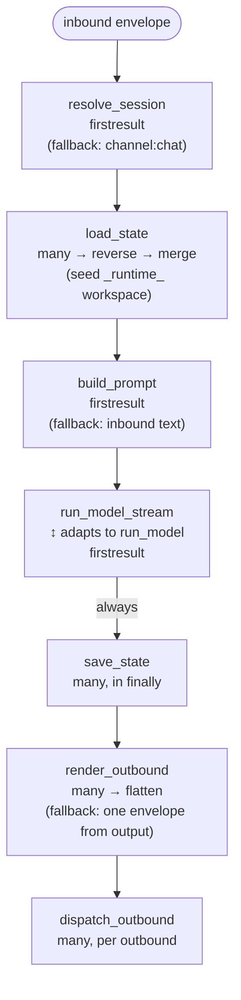

This page explains what `BubFramework.process_inbound` does for one inbound message, in source order, and what falls back when a hook returns nothing or raises.

A *turn* is one full pass: one inbound envelope in, zero or more outbound envelopes out, and one or more entries appended to the session [tape](/docs/concepts/tape-and-context/).

## End-to-end flow

## Stages, in source order

### resolve_session

`firstresult`: returns a session id for the inbound envelope. If every implementation returns `None`, the kernel falls back to `f"{channel}:{chat_id}"` (each defaulting to `"default"`).

The resolved id is also written back into the envelope's `session_id` slot when the envelope is a mutable mapping.

### load_state

Broadcast: every implementation contributes a state dict. The kernel calls implementations in priority order, collects the results, then reverses those results before merging. Low-priority state is merged first and high-priority state last, so later-registered plugins win on key collisions.

### build_prompt

`firstresult`: returns either a string or a list of multimodal content parts (OpenAI format). `HookRuntime.call_first` stops at the first non-`None` return value. If no implementation returns a non-`None` value, or the selected value is falsy, `process_inbound` falls back to the inbound envelope's plain `content`; a falsy selected value does not cause lower-priority implementations to run.

### run_model and run_model_stream

Both are `firstresult`. Implementations should provide one or the other, not both:

- `run_model` returns a final string in one call.
- `run_model_stream` returns an `AsyncStreamEvents` iterator of chunks (`text`, `error`, ...).

The hook runtime adapts between them: if a plugin only implements `run_model_stream` and the framework was asked for a non-streaming output, the kernel collects every `text` event's `delta` and joins them. If only `run_model` is implemented, it is wrapped as a stream of one text chunk when the caller asked for streaming. A streaming implementation is expected to return an `AsyncStreamEvents`; returning `None` from `run_model_stream` in the non-streaming adapter path is currently an error rather than a clean fallback.

If neither hook returns output (every implementation returns `None`), the kernel notifies `on_error(stage="run_model", ...)` and falls back so `save_state` and the outbound stages still run. A string prompt is returned unchanged; a multimodal list prompt falls back to the inbound envelope's plain `content`.

While streaming, every `error` event is forwarded through `on_error(stage="run_model", ...)`. A bound `OutboundChannelRouter` may also wrap the stream to push partial chunks to the channel before the turn finishes.

### save_state

Broadcast, **always invoked** in a `finally` block — even if `run_model` raises. Implementations receive `session_id`, `state`, the inbound `message`, and the captured `model_output` (which may be empty if the model raised).

This is the place to flush per-turn lifespans, persist state mutations, or close per-message resources. Built-in `BuiltinImpl.save_state` reads `sys.exc_info()` so a per-message lifespan context can observe the failure.

### render_outbound

Broadcast: every implementation returns a list of outbound envelopes. The kernel flattens all batches.

If every implementation returns an empty list, the kernel emits one fallback envelope built from `model_output` plus the inbound `channel` and `chat_id`.

### dispatch_outbound

Broadcast, called per outbound envelope. Implementations may return `True` once the envelope is delivered. The built-in implementation also forwards the envelope to a bound `OutboundChannelRouter` for actual channel I/O.

## on_error semantics for `stage="turn"`

If any stage above raises an unhandled exception, `process_inbound`:

1. Logs the exception.
2. Calls `on_error(stage="turn", error=exc, message=inbound)` so observer plugins can react.
3. Re-raises the original exception.

The default observer (`BuiltinImpl.on_error`) sends an error envelope through `dispatch_outbound` so the failure is visible on the inbound channel rather than only in logs.

`on_error` is observer-safe: the runtime does not propagate exceptions raised by individual observers, so one failing observer does not block the others.

## What the default plugin actually implements

`BuiltinImpl` (registered as `builtin`) implements every hook above with sensible defaults:

- `resolve_session` — uses the envelope's `session_id` if present, otherwise `f"{channel}:{chat_id}"`.
- `load_state` — opens the inbound's optional `lifespan`, seeds `session_id` and an internal `_runtime_agent`.
- `build_prompt` — handles comma commands (`,help`, `,skill`, ...), wraps text with timestamp and context, and emits multimodal parts when media is attached.
- `run_model` / `run_model_stream` — delegate to `Agent.run` / `Agent.run_stream`, the [Republic](https://github.com/bubbuild/republic)-backed loop with tool use and auto-handoff (see [Tape and context](/docs/concepts/tape-and-context/)).
- `save_state` — closes the per-message lifespan with the captured exception info.
- `render_outbound` — wraps `model_output` into one `ChannelMessage` carrying the inbound's routing fields.
- `dispatch_outbound` — forwards through the bound `OutboundChannelRouter`.
- `system_prompt` — combines a default prompt with the workspace `AGENTS.md`.
- `provide_tape_store` — file-backed tape store under `~/.bub/tapes`.
- `provide_channels` — registers the built-in `cli` and `telegram` adapters.

Plugins override any of these by registering a higher-priority implementation; later-registered plugins run first.

## Next steps

- [Tape and context](/docs/concepts/tape-and-context/) — what the `run_model_stream` stage actually reconstructs.
- [Surfaces](/docs/concepts/surfaces/) — how channels, skills, and tools meet on the envelope and state.
- [Hooks reference](/docs/reference/hooks/) — full hookspec signatures.
