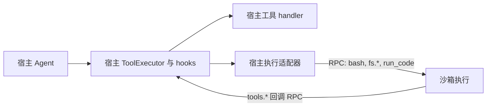

本指南展示如何打包一个 Bub **插件** —— 一个注册到 `bub` 入口点组、并向框架运行时贡献[钩子](/zh-cn/docs/concepts/turn-pipeline/)实现的 Python 发行包。

如果要加载包含 `plugin.json`、skills 和 MCP 服务器的可移植 Agent Plugins，请参阅
[加载 Agent Plugins](/zh-cn/docs/tutorials/agent-plugins/)。负责接入的 `bub-agent-plugins` 本身是一个 Python
插件；它加载的可移植插件包不需要声明 Python 入口点。

## 开始之前

- 已安装 `uv` 和 `bub` 的 Python 3.12+ 环境（见[安装](/zh-cn/docs/getting-started/install/)）。
- 已经走过一次完整的 Bub 轮次（见[首次轮次](/zh-cn/docs/getting-started/first-turn/)）。
- 一个基于 `pyproject.toml` 的构建后端；下面示例使用 `hatchling`。

## 1. 包结构

最小插件 = 一个 Python 包加一个 `pyproject.toml`：

```text
bub-myplugin/
├─ pyproject.toml
└─ src/
   └─ bub_myplugin/
      ├─ __init__.py
      ├─ plugin.py
      └─ tools.py        # 可选，见步骤 4
```

发行名建议以 `bub-` 开头（例如 `bub-myplugin`）。导入名通常把短横线换成下划线（`bub_myplugin`）。

## 2. 声明入口点

Bub 通过 `bub` 组的 Python 入口点发现插件。在 `pyproject.toml` 里加入：

```toml
[project]
name = "bub-myplugin"
version = "0.1.0"
dependencies = ["bub>=0.3"]

[project.entry-points."bub"]
myplugin = "bub_myplugin.plugin"

[tool.hatch.build.targets.wheel]
packages = ["src/bub_myplugin"]
```

左侧入口点键（`myplugin`）是 Bub 用于诊断的名字，右侧是 Bub 启动时导入的目标。

## 3. 在模块、实例、可调用三种形态中选择

[`BubFramework.load_hooks()`](https://github.com/bubbuild/bub/blob/main/src/bub/framework.py#L66-L90) 接受三种入口点目标。`if callable(plugin)` 分支是判别点：

```python
# 来自 src/bub/framework.py
if callable(plugin):  # Support entry points that are classes
    plugin = plugin(self)
self._plugin_manager.register(plugin, name=plugin_name)
```

由此得到三种合法选择。

**模块目标。** 指向一个在模块层定义了 `@hookimpl` 函数的模块。Bub 直接注册这个模块对象：

```toml
[project.entry-points."bub"]
myplugin = "bub_myplugin.plugin"
```

```python
# bub_myplugin/plugin.py
from bub import hookimpl


@hookimpl
def build_prompt(message, session_id, state):
    return "custom prompt"
```

**实例目标。** 指向一个事先构造好的实例。Bub 原样注册：

```toml
[project.entry-points."bub"]
myplugin = "bub_myplugin.plugin:my_plugin"
```

```python
# bub_myplugin/plugin.py
from bub import hookimpl


class MyPlugin:
    @hookimpl
    def build_prompt(self, message, session_id, state):
        return "custom prompt"


my_plugin = MyPlugin()
```

**可调用目标（类或工厂）。** 指向一个把 [`BubFramework`](https://github.com/bubbuild/bub/blob/main/src/bub/framework.py) 作为唯一参数的类或工厂。Bub 用框架调用它，再把返回值注册进去。当插件需要持有框架的活引用时使用——例如要在 CLI 已经处理过 `--workspace` 之后再读 `framework.workspace`：

```toml
[project.entry-points."bub"]
myplugin = "bub_myplugin.plugin:MyPlugin"
```

```python
# bub_myplugin/plugin.py
from bub import BubFramework, hookimpl


class MyPlugin:
    def __init__(self, framework: BubFramework) -> None:
        self.framework = framework

    @hookimpl
    def build_prompt(self, message, session_id, state):
        workspace = self.framework.workspace
        return f"custom prompt from {workspace}"
```

visual-base 的 [`EyeImpl`](https://github.com/oilbeater/visual-base/blob/main/src/bub_eye/plugin.py) 正是因为这个原因采用可调用形态：它捕获框架，从而 `provide_channels` 时能读到 CLI 处理后的工作区。

:::note
内置插件最先注册，入口点插件随后注册。在 [`HookRuntime`](https://github.com/bubbuild/bub/blob/main/src/bub/hooks/runtime.py) 中，注册越晚优先级越高 —— 因此你的 `firstresult` 钩子会覆盖内置实现。
:::

## 4. 用可编辑安装迭代

把插件安装到运行 `bub` 的同一个 Python 环境中。如果你已经激活了该环境，在插件目录下运行：

```bash
uv pip install -e .
```

Bub 从当前 Python 环境加载入口点，因此可编辑安装能在不重新安装的情况下吃到代码变更。如果你不在一个已激活的 Bub 虚拟环境中，请在插件项目中运行 `uv sync`，并从该项目里使用 `uv run bub ...`。同样的模式见[首个插件](/zh-cn/docs/getting-started/first-plugin/)。

## 5. 确认 Bub 已加载插件

运行钩子诊断命令：

```bash
uv run bub hooks
```

每个已注册钩子会列出贡献它的插件。该命令展示发现到的实现顺序，不等价于精确的 firstresult 胜出者；运行时优先级见[钩子参考](/zh-cn/docs/reference/hooks/#iteration-order)。一个覆盖了 `build_prompt` 与 `run_model` 的 `EchoPlugin`，预期输出形如：

```text
build_prompt: builtin, echo
run_model: builtin, echo
...
```

如果每一行都没有你的插件名，说明入口点没有加载。常见原因：

- 入口点组写错了 —— 必须是 `bub`（不是 `bub.plugins`）。
- 包没安装到当前 Python 环境。
- 模块导入时抛错。Bub 会以 `Failed to load plugin '<name>'` 记录错误。

## 真实示例

上述模式在已发布的插件中都能看到：

- [`bub-tapestore-sqlite`](https://github.com/bubbuild/bub-contrib/tree/main/packages/bub-tapestore-sqlite) —— 模块目标，顶层 `@hookimpl`。
- [`bub-schedule`](https://github.com/bubbuild/bub-contrib/tree/main/packages/bub-schedule) —— 实例目标（`schedule = "bub_schedule.plugin:main"`）。
- [`bub-wechat`](https://github.com/bubbuild/bub-contrib/tree/main/packages/bub-wechat) 与 visual-base 的 [`bub-eye`](https://github.com/oilbeater/visual-base/tree/main/src/bub_eye) —— 持有框架引用的可调用类目标。

## 执行环境

### 适用场景

需要把文件、Shell 或代码执行移出宿主，同时将 Tape、模型调用和工具调度留在宿主时，可以编写执行环境插件。适配器可以把三类操作都交给容器，也可以只把 `run_code` 放进 WASI 运行时，或组合容器中的文件和 Shell 与 WASI 中的代码执行。这些是适配方案，不是内置后端；只处理代码的适配器需要显式组合文件和 Shell 的提供方。

### 执行路径

工具 handler 仍在宿主运行，由适配器通过自己的通信机制委托沙箱执行。代码调用 `tools.*` 时，请求返回宿主，经工具执行器和原有拦截 hooks 调用工具。



RPC 由适配器实现，不需要独立的 Bub hook。图中展示模型工具调用和代码回调；显式逗号命令采用直接分发。代码只能回调 code mode 暴露的工具，不能访问整个宿主工具注册表。`preserve` 控制工具的可见性，不决定执行位置。

### 接入契约

实现 `provide_execution_environment(session_id, state)`，返回 `bub.environment` 中的 `ExecutionEnvironment`。

- **绑定执行工具：** 每轮开始时，Bub 对本轮存在的 `bash`、`bash.output`、`bash.kill`、`fs.read`、`fs.write`、`fs.edit` 和 `run_code` 调用一次 `bind_tools(tools)`。返回名称和公开契约不变、handler 已适配的工具；不支持时应报错。其他工具保留宿主 handler，不修改共享 Agent。
- **分发代码回调：** 在宿主侧的 `run_code` handler 中使用 `bub.builtin.codemode.code_tool_callbacks(context)`，获取本轮按名称组织的异步回调，保留上下文、结构化结果和工具 hooks。RPC 只暴露这些回调；序列化、并发和取消由适配器负责。
- **映射资源：** `map_resource(source)` 为显式加载的 skill 和 code mode stub 返回执行侧路径。Provider 负责复制或挂载及资源生命周期；映射不代表同步或写回。Skill 使用映射后的 `$SKILL_DIR` 和可选的 `render_context["PYTHON"]`（默认 `python`）渲染内容。

### 切换与生命周期

每轮固定一个绑定。`,environment <reference>` 经 provider 授权后选择下一轮的环境，切回 `default` 也需要授权。有受管后台任务时拒绝切换；命名环境不可用时报错，不回退到宿主。Tape 保存选择，但不迁移文件和进程。

Provider 负责保留实例、销毁资源和重启后的恢复。`,quit` 等待 `stop()` 完成；该方法应取消所属任务，但不销毁保留环境。消费或关闭 Agent stream 才会释放绑定；不支持嵌套执行同一会话。Tape 更新失败前已准备的资源可能仍被保留。

本地执行是可信宿主执行，不提供隔离。自动展开到 prompt 的 skill 内容仍在宿主处理，需要资源映射时请显式加载 skill。执行工具集合是固定的，不是任意插件工具的路由注册表。

## 下一步

- [钩子](/zh-cn/docs/build/hooks/) —— 各钩子签名的配方手册
- [工具](/zh-cn/docs/build/tools/) —— 注册可被模型调用的工具
- [钩子参考](/zh-cn/docs/reference/hooks/) —— 完整签名表
- [发行版](/zh-cn/docs/build/distribution/) —— 把插件打包为产品
