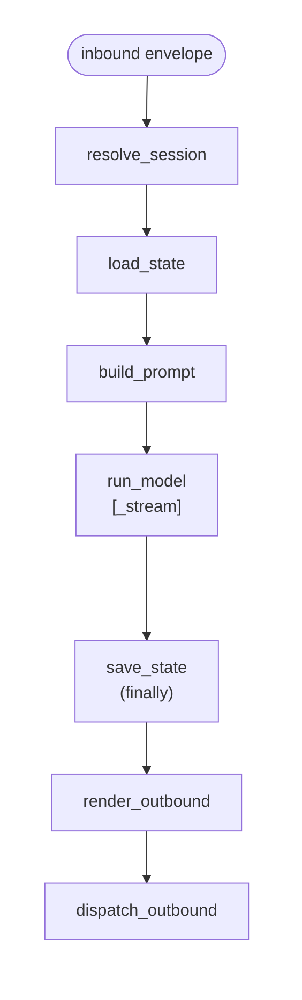

本节解释 Bub 的设计模型：内核为何小、一次 turn 究竟做了什么、context 如何从 tape 重建，以及三个扩展面在哪里相遇。

## 如何阅读本节

第一遍按顺序读完四个页面。每页都很短且自洽：

1. [Philosophy](/zh-cn/docs/concepts/philosophy/) — 内核为何严格、插件为何宽松，以及 operator 为何对等。
2. [Turn pipeline](/zh-cn/docs/concepts/turn-pipeline/) — `process_inbound` 顺序执行了什么、各处 fallback 何时生效。
3. [Tape and context](/zh-cn/docs/concepts/tape-and-context/) — append-only 的 tape 如何变成模型 context window。
4. [Surfaces](/zh-cn/docs/concepts/surfaces/) — channel、skill 与 tool 这三条独立扩展轴。

第一遍之后，把每页当参考，按需返回查阅。

## 一图速览 turn 流程

下面这张图会在 [Turn pipeline](/zh-cn/docs/concepts/turn-pipeline/) 中详细展开：

`save_state` 始终在 `finally` 块中执行；`render_outbound` 与 `dispatch_outbound` 仅在 turn 成功时执行。

## 术语表

每个术语跳到其定义所在页面：

- [Hook](/zh-cn/docs/concepts/turn-pipeline/) — 内核在一次 turn 中调用的 [pluggy](https://pluggy.readthedocs.io/) 扩展点。
- [Plugin](/zh-cn/docs/concepts/philosophy/) — 任何注册到 `bub` entry-point 组的包。
- [Tape](/zh-cn/docs/concepts/tape-and-context/) — 单个 session 的 append-only 事实序列。
- [Entry](/zh-cn/docs/concepts/tape-and-context/) — tape 上的一条不可变记录。
- [Anchor](/zh-cn/docs/concepts/tape-and-context/) — 内核可据以重建 context 的检查点。
- [Handoff](/zh-cn/docs/concepts/tape-and-context/) — 受约束的阶段过渡，会写入新的 anchor。
- [Channel](/zh-cn/docs/concepts/surfaces/) — 对外 I/O 表面（CLI、Telegram 等）。
- [Skill](/zh-cn/docs/concepts/surfaces/) — operator（人或 agent）按名字调用的可复用流程。
- [Tool](/zh-cn/docs/concepts/surfaces/) — 模型可调用的有类型动作。
- [Envelope](/zh-cn/docs/concepts/surfaces/) — 在 turn pipeline 中传递的 duck-typed 负载。

## 下一步

- [Philosophy](/zh-cn/docs/concepts/philosophy/) — 进入本节。
- [Hooks 参考](/zh-cn/docs/reference/hooks/) — 需要时查阅完整 hookspec 签名。
