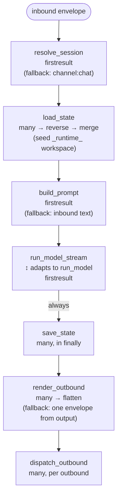

本页解释 `BubFramework.process_inbound` 对一条 inbound 消息按源码顺序执行的内容，以及 hook 返回空或抛错时各处 fallback 的行为。

一次 *turn* 是一次完整流转：一条 inbound envelope 进入，零或多条 outbound envelope 输出，并向 session [tape](/zh-cn/docs/concepts/tape-and-context/) 追加一条或多条 entry。

## 端到端流程

## 各阶段（按源码顺序）

### resolve_session

`firstresult`：为 inbound envelope 返回 session id。如果所有实现都返回 `None`，内核 fallback 为 `f"{channel}:{chat_id}"`（两者各自缺省 `"default"`）。

当 envelope 是可变映射时，解析得到的 id 也会被写回 envelope 的 `session_id` 字段。

### load_state

广播：每个实现贡献一份 state dict。内核先用 `_runtime_workspace` 初始化 state，然后按优先级调用实现、收集结果，再反转结果列表后合并。低优先级 state 先合并，高优先级 state 后合并，因此晚注册的插件在键冲突时胜出。

### build_prompt

`firstresult`：返回字符串或多模态内容片段列表（OpenAI 格式）。`HookRuntime.call_first` 会停在第一个非 `None` 返回值。如果没有实现返回非 `None` 值，或选中的值为 falsy，`process_inbound` 会 fallback 为 inbound envelope 的纯 `content` 字段；已选中的 falsy 值不会触发继续尝试低优先级实现。

### run_model 与 run_model_stream

两者都是 `firstresult`。实现应当二选一：

- `run_model` 一次返回最终字符串。
- `run_model_stream` 返回 `AsyncStreamEvents` 的 chunk 流（`text`、`error` 等）。

hook 运行时会在两者间互相适配：若插件只实现 `run_model_stream` 且框架要求非流式输出，内核会收集每个 `text` 事件的 `delta` 并拼接；若只实现 `run_model` 且调用方要求流式，则被包装为单个 text chunk 的流。`run_model_stream` 实现应返回 `AsyncStreamEvents`；当前非流式适配路径中返回 `None` 会成为错误，而不是干净 fallback。

如果两者都没有返回输出（每个实现都返回 `None`），内核会通过 `on_error(stage="run_model", ...)` 通知并 fallback，使 `save_state` 与后续 outbound 阶段仍能运行。字符串 prompt 会原样返回；多模态 list prompt 会 fallback 为 inbound envelope 的纯 `content` 字段。

流式过程中，每个 `error` 事件都会通过 `on_error(stage="run_model", ...)` 转发。绑定的 `OutboundChannelRouter` 也可在 turn 结束前包装该流，将增量 chunk 推送到 channel。

### save_state

广播，**始终在 `finally` 块中调用** —— 即便 `run_model` 抛错。实现接收 `session_id`、`state`、inbound `message`，以及已捕获的 `model_output`（模型抛错时可能为空字符串）。

这里适合 flush per-turn lifespan、持久化 state 变更或关闭 per-message 资源。内置 `BuiltinImpl.save_state` 会读取 `sys.exc_info()`，使 per-message lifespan context 可观察到失败。

### render_outbound

广播：每个实现返回 outbound envelope 列表，内核将所有批次拍平。

如果所有实现都返回空列表，内核会用 `model_output` 加 inbound 的 `channel`、`chat_id` 构造一条 fallback envelope。

### dispatch_outbound

广播，按每条 outbound envelope 调用一次。实现可在投递完成后返回 `True`。内置实现还会把 envelope 转发到绑定的 `OutboundChannelRouter` 进行实际 channel I/O。

## `stage="turn"` 的 on_error 语义

如果上述任一阶段抛出未处理异常，`process_inbound` 会：

1. 记录异常日志。
2. 调用 `on_error(stage="turn", error=exc, message=inbound)`，让 observer 插件可以响应。
3. 将原异常重新抛出。

默认 observer（`BuiltinImpl.on_error`）会通过 `dispatch_outbound` 发送一条错误 envelope，使失败在 inbound channel 可见，而不仅停留在日志。

`on_error` 是 observer-safe 的：runtime 不会传播单个 observer 抛出的异常，因此一个失败的 observer 不会阻塞其他 observer。

## 默认插件实际实现了什么

`BuiltinImpl`（注册名 `builtin`）以合理默认实现上述每个 hook：

- `resolve_session` — 优先使用 envelope 的 `session_id`，否则 `f"{channel}:{chat_id}"`。
- `load_state` — 打开 inbound 的可选 `lifespan`，初始化 `session_id` 与内部 `_runtime_agent`。
- `build_prompt` — 处理 comma 命令（`,help`、`,skill` 等），用时间戳与上下文包裹文本，并在附带媒体时输出多模态片段。
- `run_model` / `run_model_stream` — 分别委托给 `Agent.run` / `Agent.run_stream`，即由 [Republic](https://github.com/bubbuild/republic) 支撑、带 tool 使用与 auto-handoff 的循环（见 [Tape and context](/zh-cn/docs/concepts/tape-and-context/)）。
- `save_state` — 用捕获的异常信息关闭 per-message lifespan。
- `render_outbound` — 将 `model_output` 包装为携带 inbound 路由字段的 `ChannelMessage`。
- `dispatch_outbound` — 转发到绑定的 `OutboundChannelRouter`。
- `system_prompt` — 将默认 prompt 与 workspace 的 `AGENTS.md` 拼接。
- `provide_tape_store` — 位于 `~/.bub/tapes` 下的文件型 tape store。
- `provide_channels` — 注册内置的 `cli` 与 `telegram` adapter。

插件通过注册更高优先级的实现来覆写其中任一项；晚注册的插件先执行。

## 下一步

- [Tape and context](/zh-cn/docs/concepts/tape-and-context/) — `run_model_stream` 阶段实际重建了什么。
- [Surfaces](/zh-cn/docs/concepts/surfaces/) — channel、skill 与 tool 如何在 envelope 与 state 上相遇。
- [Hooks 参考](/zh-cn/docs/reference/hooks/) — 完整 hookspec 签名。
